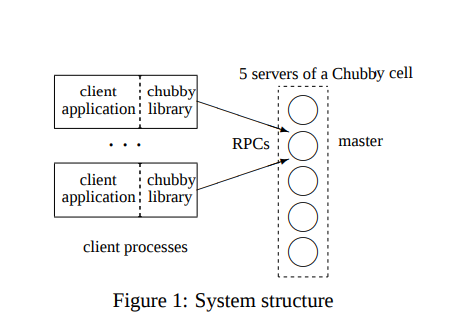
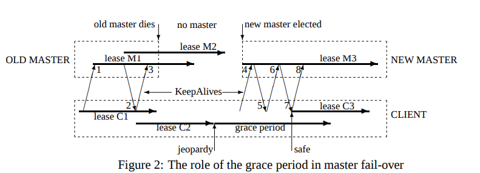

# Notes on Distributed Systems

This repository contains various insights and high-level summaries of papers, textbooks, and other readings about distributed computing.

<!-- MarkdownTOC -->

1. [Fundamental Concepts](#fundamental-concepts)
	1. [The "-ilities"](#the-ilities)
	1. [Properties of Concurrent Systems](#properties-of-concurrent-systems)
	1. [Replication](#replication)
	1. [Consistency](#consistency)
	1. [Gossip Protocols](#gossip-protocols)
1. [Chubby Lock Service \(Burrows 2006\)](#chubby-lock-service-burrows-2006)
1. [Google Spanner \(Corbett, Dean, et al. 2012\)](#google-spanner-corbett-dean-et-al-2012)

<!-- /MarkdownTOC -->

## Fundamental Concepts

### The "-ilities"

- **Reliability** - probability that a machine performs its task without failure in a given time interval. Computed as a function of mean time to failure (MTTF) and mean time to repair (MTTR).
- **Availability** - percentage of time that a service is up and running (uptime / (uptime + downtime)). A service that is highly available may not necessarily be highly reliable. E.g. A service with guaranteed downtime for 3 minutes every hour translates to a 95% availability, but a reliability of less than an hour. Conversely, highly reliable systems are also highly available. 
- **Scalability** - ability for your system to adjust compute capacity based on demand.

### Properties of Concurrent Systems

- **liveness property** - something "good" eventually happens but not sure when. E.g. What goes up must come down. The node will eventually receive the message.
- **safety property** - nothing bad happens during the execution

### Replication
- The idea of using backup or redundant resources to minimize the impact of a system failure.
- Types of failures in distributed systems
	- Independent "fail-stop" computer failures - machine runs normally, but then stops suddenly 
	- Site-wide power failures

### Consistency

- Any good distributed system designer will make use of replication to achieve high scalability and fault tolerance. But when many reads and writes are happening simultaneously across replicated nodes, how can we be sure that a read query to any of these nodes reflects the result of the most recent write to any one node, especially if it takes some time for the write to complete? After a write request completes on a shared piece of data residing on one server node, how can we ensure that the other nodes have the most up-to-date version before a read of this data happens? In certain cases, do we even need to reply immediately to a read with the most recent write? Would it be acceptable to eventually report the most recent write? Herein lies the **consistency** problem.

### Gossip Protocols

- When we don't have a single master that knows about all participants in a system, we need a way for nodes that do know each other to communicate ("gossip") and exchange information about other participants.
- Consider a simple problem of finding all nodes in a system where each node has an incomplete list of neighbors.
	- Node A: [B, D]
	- Node B: [C]
	- Node C: [D, A]
	- Node D: [B]
	- In any time step, node A can randomly ask one of its neighbors (B or D) for its list of neighbors, update itself with new information, and then in future rounds ask those new neighbors about others nodes that might be in the system. Eventually, we will reach a point where node A knows about the existence of all other nodes in the system despite the system not having a master that keeps track of everything.
- Possible to achieve distributed consistency in this way

## Chubby Lock Service [(Burrows 2006)](https://static.googleusercontent.com/media/research.google.com/en//archive/chubby-osdi06.pdf)

- Some tradeoffs in design: availability and reliability over throughput and storage capacity.
- The paper makes the assumption that lock use will be coarse-grained because unlike fine-grained locks, the former requires less load on the lock server.
- Client applications link a separate Chubby library during build time. This library enables communication between the client and the lock server, which consists of a set of distributed replicas with a single master.
	
- Clients determine the master by querying the Chubby cell servers, after which all subsequent requests directly go to the master until the master lease expires, or the node goes down. 
	- This technique of talking to the central server for a node and then redirecting future queries to the node directly is similar to the interaction of clients in the **Google File System** (GFS).
	- Clients ask the master for the location of the chunkserver with the desired data, and then direct communication is established between the chunkserver and the client in order to reduce any bottlenecks with client-master interaction.
- Scale is achieved by minimizing communication between clients and the single master in a Chubby cell.
- Chubby cells accessible via a barebones UNIX-like file system
	- Chubby ***nodes*** = files and directories that can also act as reader-writer locks
	- No hard or symbolic links
	- Each node contains metadata of
		- ACLs
		- 64-bit instance number
		- 64-bit content generation number
		- 64-bit lock generation number
		- 64-bit ACL generation number
		- 64-bit file-content checksum
- Mandatory lock - underlying resources blocked until the lock is released. Not really used in Chubby.
- Advisory lock - any service can still read/modify underlying resources; lock is just a formality. Conflict arises when multiple services try to contend for the same lock. Chubby locks are these types of locks.
- Sequencers - byte-strings with lock metadata that can be sent to the recipient server and verified. Ad-hoc way to maintain ordered interactions and overall consistency in the presence of delayed or re-ordered requests.
	- Name of the lock
	- Mode (exclusive or shared)
	- Lock generation number
- Chubby exposes a CRUD API to read/write files, acquire & release locks, set ACLs, and create sequencers.
- Clients cache node metadata and file content in in-memory, write-through caches.
- Chubby sessions can be established between clients and the Chubby cell. 
	- Sessions are associated with a timed lease, which can be extended by KeepAlive calls from the client.
	- The master can only increase the timeout when responding to a KeepAlive RPC.
	- KeepAlive replies are also used to send events and transfer cache invalidation requests.
	- Before a session expires, the client will wait for a short duration called the *grace period* before tearing down the session. If a KeepAlive message is received, the client reenables its cache.
	- Illustration of leases, grace periods, and failovers in a sample client interaction with a Chubby cell:
		
- Scaling techniques
	- Reduce communication with master as much as possible!
	- Heavy caching of metadata, file data, and handles by clients.
	- Proxies in between clients and Chubby cells that handle KeepAlive requests and reads.
	- Partitioning Chubby cells
- Applications within Google
	- Internal name service (despite Chubby's original intention to be a lock service...)
		- Takes advantage of Chubby's design: Event-driven notifications, less polling, name resolution need not be fully consistent
		- Aggressive caching in Chubby clients, so queries to the Chubby cell are only necessary after cache invalidation of a domain name (i.e. domain changes IP addresses). 
	- Configuration store for files that require high availability (e.g. access control lists)
	- Leader election in GFS and BigTable

## Google Spanner [(Corbett, Dean, et al. 2012)](https://www.usenix.org/system/files/conference/osdi12/osdi12-final-16.pdf)
* Spanner - a database of distributed Paxos state machines spread across the world
* Alternative to BigTable for applications that have complex, changing schemas or those that want strong consistency and wide-area replication.
* **TrueTime API**
	* Intent to create stronger time semantics and enforce tighter bounds on time uncertainty compared to the weaker time APIs from the past when designing distributed systems.
	* Exposes clock uncertainty. Google's in-house implementation tries to keep this uncertainty very small by referencing GPS and atomic clocks.
* Blend of multiple systems and DB requirements
	* Scalability
	* Consistency
	* Fault tolerance
	* Replication
	* Automatic sharding 
	* A simple-to-use, SQL-like query language (termed [NewSQL](https://en.wikipedia.org/wiki/NewSQL) these days)
* Strengths
	* Strongly consistent distributed transactions
	* Optimized for simple key-value access queries
	* Fine-grained replication configurations
	* Externally consistent reads/writes
	* Globally consistent reads
	* Lock-free read-only transactions
	* Atomic schema updates
* Cons
	* Node-local data structures have poor performance on complex SQL queries